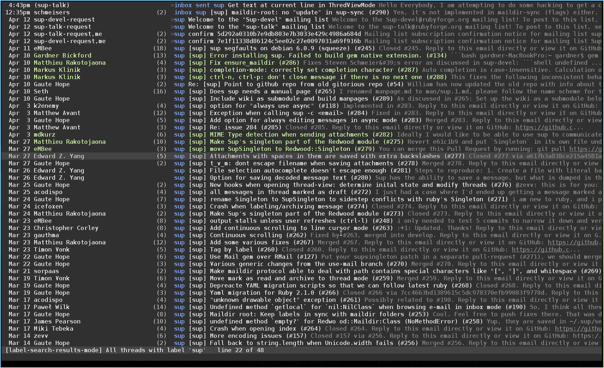
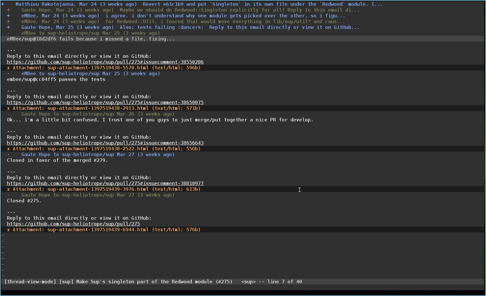

Lucius
========
A [sup](https://github.com/sup-heliotrope/sup) colorscheme. Based on the [lucius](https://github.com/jonathanfilip/vim-lucius.git) colorscheme for vim, by [jonathanfilip](https://github.com/jonathanfilip).

